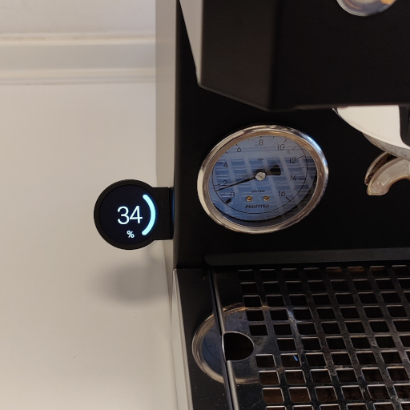
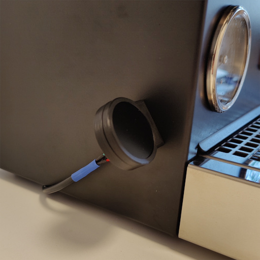
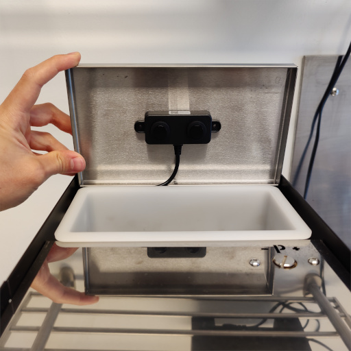
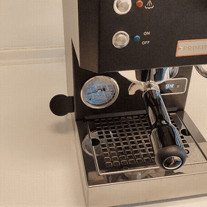

# Waterlevel-indicator and shot-timer for the Profitec GO

  
   
  

A modern display mod for espresso machines with vibrationpumps. Includes a shot-timer and waterlevel-indicator. Uses an accelerometer to detect vibrations for waking-up the display and timing shots. Measures and displays the waterlevel based on a contactless ultrasonic sensor. Attaches to the machine via a magnet for easy repositioning. The mod was originally developed and tested for the Profitec GO, however, other machines with vibrationpumps might work as well.

## Features
|Tap wake|Portafilter wake|Timer|
|---|---|---|
||||

- contactless waterlevel measurement
- easy repositioning via magnetic attachment
- automatic wake when interacting with the machine
- automatic shot-timer
- non-destructive installation, minimal wiring outside the machine
- adjustable colors, sensitivity, etc...

## Disclaimer and warning
Recreating this project involves handling dangerous things like soldering irons, 3D-printers and mains voltage. For legal reasons, handling these things should only be done by an expert. I am not responsible for any damage to you, your machine or your surrounding. Read through the complete [manual](doc/manual/manual.pdf) to decide if you feel comfortable building the mod and if it is worth the effort to you.

## Required Tools
- 3D-printer
- soldering iron
- connector crimping kit (see BoM)

## Building Instructions
The building manual can be found [here](doc/manual/manual.pdf)

## Usage notes and configuration
I unfortunately don't have a second machine to test how well the settings transfer to different machines, so here are some hints on how to dial in things like detection sensitivity and timings. All relevent parameters (**highlighted in bold**) can be adjusted in [include/config.h](include/config.h). You need to reflash the firmware after making any changes. Refer to the manual on how to flash the firmware. **Never connect to the display via USB when the display cable is plugged in to avoid damage to your computer.** The 5V lines of the USB port and the display cable are connected!

### Adjusting vibration sensing sensitivity
The parameter for controlling vibration detection sensitivity is **WAKE_THRESH**. A lower value increases sensitivity, a higher value decreases sensitivity. The value has to be larger than 0. For different machines and mounting positions of the display, a different value for **WAKE_THRESH** may be required for reliable operation. The sensitivity affects both, the wake and timer function. A good value for **WAKE_THRESH** should wake the display when gently tapping on it and should keep the timer going reliably. My method of deciding on the threshold: you should be able to wake the display by slamming your fist on the surface on which the machine is standing on but it should not wake when placing a glass of water on that surface.

### Adjusting waterlevel and warning threshold
A fill level of 0 percent is shown if the sensor reports a distance of **LEVEL_MAX_DIST_MM** millimeters or more. A fill level of 100 percent is shown if the sensor reports a distance of **LEVEL_MIN_DIST_MM** millimeters or less. You can configure these two values to account for different watertank depths. The percentage below which the color of the ring will change to orange is configured with **LEVEL_BAD_PERC**.

### Shottimer
The shottimer is displayed with a delay of two seconds, which is on purpose. When a vibration is detected, the system will timeout for two seconds and check for a vibration after that timeout. If there is still a vibration, the timer starts (taking into account the time passed during the timeout). This is done to prevent the timer activating every time someone interacts with the machine. The delay can be configured via **TIMER_TRIGGER_DELAY_MS**. Setting this to zero will start the timer instantly when the display is awake and some vibration is detected. There is also the option to adjust *how many milliseconds one timer second has* via **TIMER_INCREMENT_MS**. I noticed that the timer on my machine seems to count a bit faster than a full second and verified that with the stopwatch of my smartphone. So you have that option to sync it with your machine timer.

### Deactivating waterlevel function or timer function
If you do not need the waterlevel but want the timer function, the system can be used without plugging in any levelsensor. The default wakescreen will be an orange ring with a questionmark, indicating a missing sensor. If you don't want the shottimer function, you can deactivate it by setting **ENABLE_TIMER** to false.

## Bill of materials (BoM)

The following items are necessary to build the waterlevel indicator. Items marked with a (*) at the beginning do not need to be the exact listed item but may be replaced with something else. Sourcing links are included for people based in germany (those are the shops where I got the items from).

|Item|Amount|Description|Comment|Sourcing (DE)|
|---|---|---|---|---|
|Waveshare RP2040-LCD-1.28|1|3-in-1 display, IMU and microcontroller|-|[BerryBase](https://www.berrybase.de/rp2040-mcu-board-1-28-zoll-runde-lcd-beschleunigungssensor-und-gyroskop)|
|DFRobot A02YYUW|1|waterproof ultrasonic sensor to measure waterlevel|-|[BotLand](https://botland.de/ultraschall-abstandssensoren/15717-ultraschall-abstandssensor-a02yyuw-3-450cm-wasserdicht-dfrobot-sen0311-5904422377984.html)|
|4-core wire|~1m|wire between display, sensor and power supply|I recommend using any old USB cable which you don't need anymore. For the Profitec Go, the wire diameter has to be smaller than 6mm to fit through one of the holes in the bottom of the machine!|-|
|M3 screw|1|required to screw the two 3D-printed parts together|12mm length|-|
|M3 Nut|1|required to secure the M3 screw|-|-|
|*Meanwell LPV-20-5|1|power supply to convert mains voltage to 5V|any small 5V power supply capable of delivering more than 0.5W should work, make sure they have fault-protection and have sufficient IP classification. This one is overkill with 15W but leaves headroom for future mods|[Reichelt](https://www.reichelt.de/led-trafo-15-w-5-v-dc-3000-ma-mw-lpv-20-5-p185792.html?&trstct=pos_14&nbc=1)|
|*Disc neodym magnet 12mm x 5mm|1|-|a smaller magent also works as long as it is strong enough. The magnet compartment is 12mm in diameter and 5mm high.|[Maqna](https://www.maqna.de/neodym-scheibenmagnet-13x5mm-vernickelt-grade-n45)|
|*Tesa Powerbond doublesided tape|~15cm|used for mounting the ultrasonic sensor and 5V power supply to the machine|other doublesided tape works too, make sure it has some thickness to it, since the bottom surface of the sensor is slightly recessed|[Hornbach](https://www.hornbach.de/p/tesa-powerbond-montageband-ultra-strong-1-5m-x-19mm/8643115/)|
|*Dupont 2-Pin Male and Female connectors|2|connects the display unit to the sensor and power supply|4x 1-pin is also possible. Only the 1-pin and 2-pin connectors fit through the holes in the bottom of the Profitec GO (~6mm diameter). Note: the linked product includes the required crimping tools and also the JST-XH connectors listed next|[Amazon](https://www.amazon.de/SOMELINE%C2%AE-Crimpzange-Stecker-JST-XH-EI-Serie/dp/B0C8N8JBDC/ref=sr_1_3?__mk_de_DE=%C3%85M%C3%85%C5%BD%C3%95%C3%91&crid=3J1K71LNK2FDV&dib=eyJ2IjoiMSJ9.pArUK_eGty1pAgamqIY4_BHLJO1GMTUpvBCKUM6AajcX0ukeQaeLbxZTvJBAs86amfG5XtzwkAoNbBgEeIc5P0AreLSgwFRoLUT5_rjJkrtYyds6TmB06oM81KUYJ0z-ANbTlGseP2Wnnz54JKPoMP5xAROhVmjchvUUhs9nUkRk5gD6pNmIGrcszs6fYatRbKhPy3f6j97A1tpQAMwPtl34kOTrETaFiA0MgZWvaIdlv-E2zAWOIiZD48I_HoaKaaoXz4pE82fpEx_Ywy7sNCCHhJLpBkRttwkq1zJLzNs.26g--6kJexrT3M9r00q73i490hw2o_FcewUZZjJ7lT4&dib_tag=se&keywords=someline%2Bdupont&qid=1719741155&sprefix=someline%2Bdupont%2Caps%2C71&sr=8-3&th=1)|
|*JST-XH 4-Pin Male and Female connectors|2|connectors for display unit and sensor unit|other 4-pin connectors are also possible, but the 3D-printed parts are designed to house a JST-XH 4-Pin Female port.|see Dupont connectors|
|*JST-XH 2-Pin Male and Female connectors|1|connector for wiring harness and power supply|other 2-pin connectors are also possible|see Dupont connectors|
|*Wago 221-413 splicing connector|2|used to hook into the 230V line and connect the 5V power supply|it is also possible to instead build Y-splitters with connectors that are compatible with your machine to have a non-destructive installation|[Hornbach](https://www.hornbach.de/p/wago-221-413-compact-verbindungsklemme-0-14-4mm-3-leiter-hebelklemme-12-stueck/10593116/)|

Apart from the items listed above, you will need common consumables like **shrink tubing, solder and 3D-printer filament**.

It is also possible to connect the display, sensor and power supply by directly soldering the wires together if you do not want to buy and crimp any connectors. In this case, you won't be able to detach the display or sensor without cutting the wires.

### Support me
If you want to give something back, you can download the **.stl** models for 3D-printing from my [Printables project](https://www.printables.com/de/model/931582-profitec-go-waterlevel-indicator-with-shot-timer) to help me fill my Prusameters. Thank you :)